# Hello World, I'm Krzysztof! 👋

Hey, my name is Krzysztof! You can call me Chris if it's easier for you - Krzysztof is just 'Christopher' written in a funky Polish way. 😉

I'm a Senior DevOps Consultant at [AWS Professional Services](https://aws.amazon.com/professional-services/), where I help some of AWS' largest customers build production-grade cloud solutions - combining hands-on engineering with strategic consulting.

In my "past life", I've been a robotics engineer. I switched to IT after working on Industrial IoT and Physics High Performance Computing projects at Bosch Rexroth and (as a summer student) at the CERN LHCb experiment.

📫 How to reach me:

 

---

## 💼 Work stuff

I'm a Senior DevOps Consultant at [AWS](https://aws.amazon.com) [Professional Services](https://aws.amazon.com/professional-services/) [Generative AI Innovation Center](https://aws.amazon.com/ai/generative-ai/innovation-center/) in Warsaw! 🇵🇱

In my current role I work across the full consulting cycle - from shaping engagements and architecting solutions to hands-on delivery. Most of my work revolves around generative AI and productionalization of AI-based solutions that drive real business value.

Technically, I specialize in serverless backend development (Python), Kubernetes (EKS) for inference and HPC workloads, scalable Infrastructure as Code (CDK / Terraform / SAM / Helm), and DevSecOps - preventive and reactive security controls baked into delivery pipelines.

My superpower is insisting on the highest standards across software development teams - both in how we work (DevSecOps culture) and what we build (production-ready, safe, operations-friendly products).

---

## 🎤 Public Speaking

I regularly speak at Python and cloud conferences across Europe. Proven track record of highly-rated sessions (avg. **4.82/5** across all rated talks, 2022-2026).

| Year | Event | Role | Topic |
|------|-------|------|-------|
| 2026 | [Warsaw IT Days](https://warszawskiedniinformatyki.pl/en/) | Speaker | Monads in Python: Math Hell or Pure Perfection? |
| 2025 | [PyCon Wrocław 2025](https://2025.pyconwroclaw.com/) | Speaker | Async Python: Concurrency without the Headaches |
| 2025 | [EuroPython 2025](https://ep2025.europython.eu/) | Speaker | Async Python: Concurrency without the Headaches |
| 2025 | [AWS Summit Poland](https://aws.amazon.com/events/summits/poland/) | Workshop Co-Host | Reducing Hallucinations in Generative AI Applications |
| 2025 | [Warsaw IT Days](https://warszawskiedniinformatyki.pl/en/) | Speaker | Async Python: Concurrency without the Headaches |
| 2024 | [PyCon PL 2024](https://pl.pycon.org/2024/en/) | Speaker | AWS Lambda Powertools and Pydantic |
| 2024 | [PyCon Wrocław 2024](https://2024.pyconwroclaw.com/) | Speaker | Building CLIs in 2024 (feat. uv and Typer) |
| 2024 | [Python Summit Warsaw](https://pythonsummit.org/en/) | Speaker | Building CLIs in 2024 (feat. uv and Typer) |
| 2024 | [Andersen DevOps Meetup](https://people.andersenlab.com/events/devops-meetup-andersen-with-aws) | Speaker | Scaling on AWS for Your First 10 Million Users |
| 2023 | [Tech to the Rescue - Air Quality Hackathon](https://www.techtotherescue.org/) | AWS Hack-Mentor | AWS Cloud & ML guidance for 170+ teams across 27 countries |
| 2023 | [Perspektywy Women in Tech Summit](https://2023.womenintechsummit.pl/) | Workshop Organizer | Learn Python on AWS (~40 attendees) |
| 2022 | [CodeEurope](https://www.codeeurope.pl/) | Speaker | SecOps on AWS: Large Scale Cloud Threat Prevention, Detection and Auto-Remediation |
| 2022 | [AWS Cloud Thursday (Twitch)](https://www.twitch.tv/awspolska) | Guest Speaker | AWS CDK (Polish) |
| 2022 | Warsaw University of Technology | Guest Lecturer | Introduction to AWS Cloud |
| 2019 | [HackYeah](https://hackyeah.pl/) | Mentor | Bosch Rexroth challenge |

**Selected recordings:**
- 📹 [EuroPython 2025 - Async Python: Concurrency without the Headaches](https://youtu.be/dynFJWVqsa4?t=3792)
- 📹 [AWS Cloud Thursday - AWS CDK (Polish)](https://www.youtube.com/watch?v=9-Nas5Fsa6o)

---

## 🕔 Private stuff

I'm passionate about music - I love to explore different aspects of it (theory, genres, folk etc) and discuss / exchange discoveries with my peers. I spend most of my free time playing my guitars & piano, tinkering with my 3D printers or writing some code for my pet projects.

As you might have already guessed, I'm a big nerd. 🤓

---

## 📜 Certification flex (yeah I know..)

I love learning new things, here are some certifications / skill badges that I've earned!

### ☁️ Amazon Web Services (AWS)

[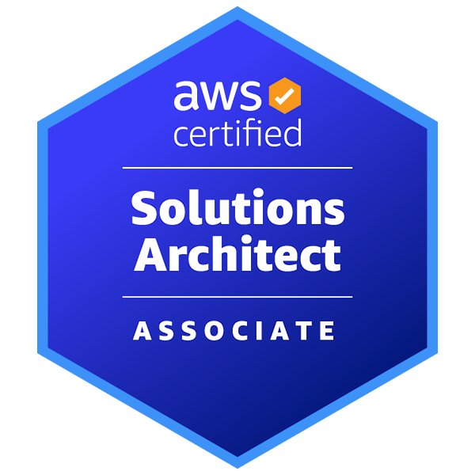](https://www.credly.com/badges/851cf9b7-45b4-44fb-b4b9-65edaf076e3b/public_url) [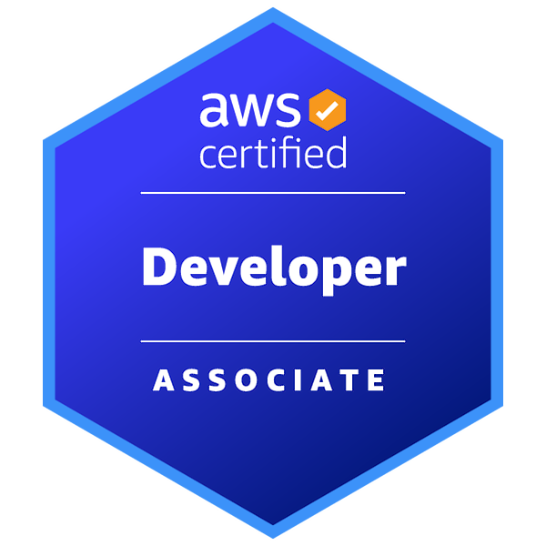](https://www.credly.com/badges/b3a215d2-4e0e-48b1-9a9a-0fd77dff9310/public_url) [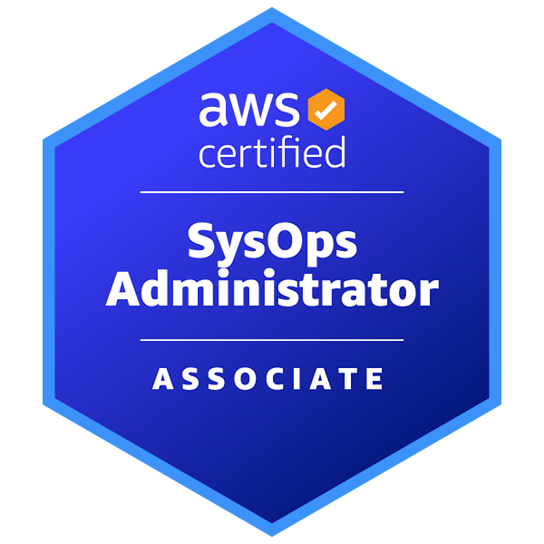](https://www.credly.com/badges/efe8399f-1e6b-45bf-943e-1b490ce260ca/public_url) [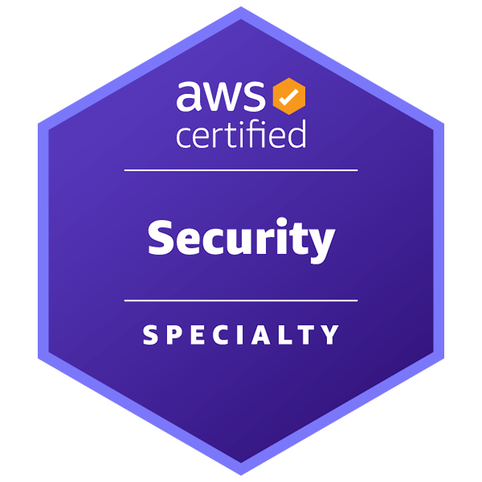](https://www.credly.com/badges/e1ee4a67-df1f-4bab-abd6-50da617578c9/public_url)

[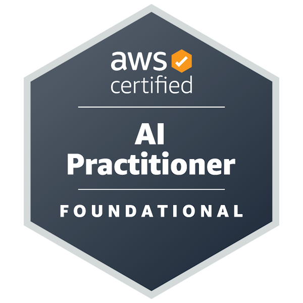](https://www.credly.com/badges/8878ce00-d0bb-4419-a8f8-e675b528b447/public_url) [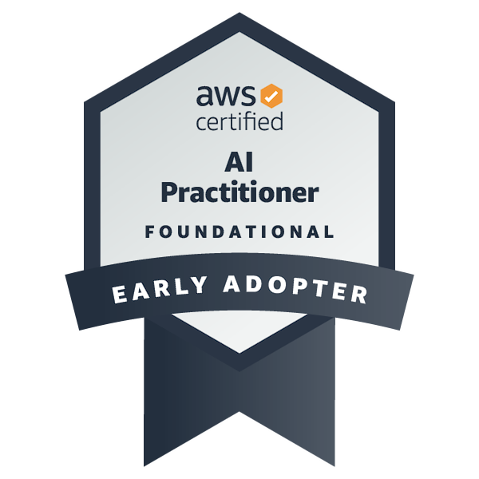](https://www.credly.com/badges/06c7cad8-736c-4c7d-b061-e6c84745aeca/public_url)

[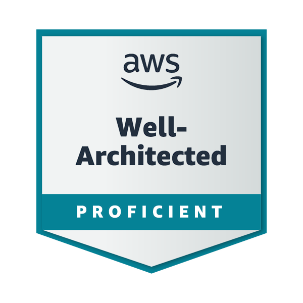](https://www.credly.com/badges/27083a18-857f-4a2a-bf72-a3b25cffdc88/public_url) [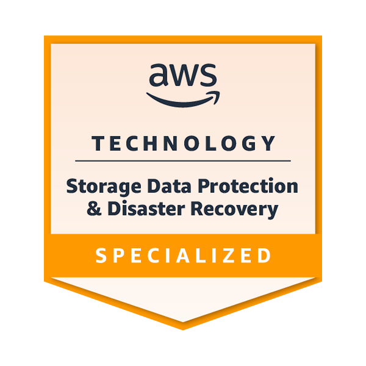](https://www.credly.com/badges/c18c437b-669b-4b03-8d50-eb2ec5ae929e/public_url)

[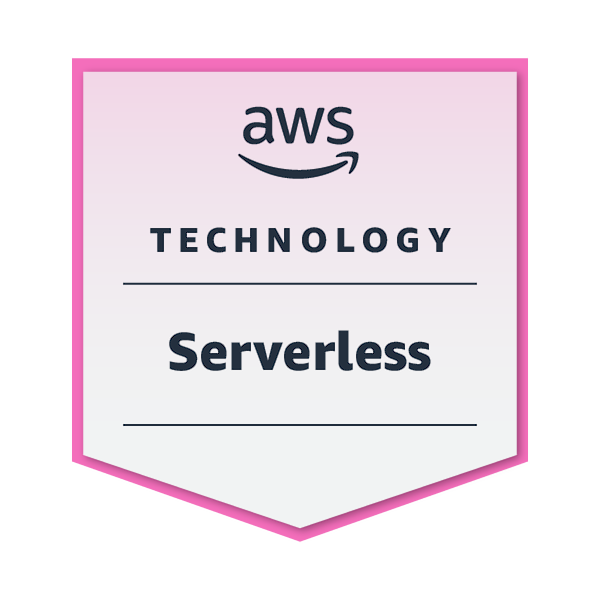](https://www.credly.com/badges/a17fc81c-868f-4eef-be64-983e4e59bd39/public_url) [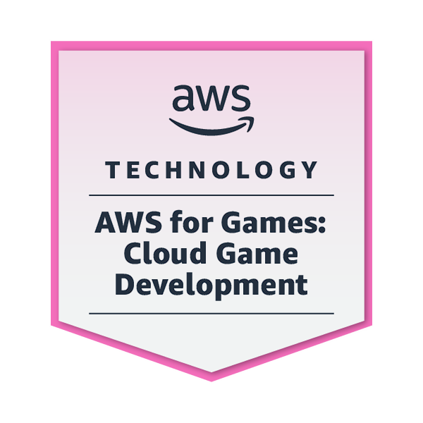](https://www.credly.com/badges/24298675-3add-4451-b4f2-9abcc1a91747/public_url) [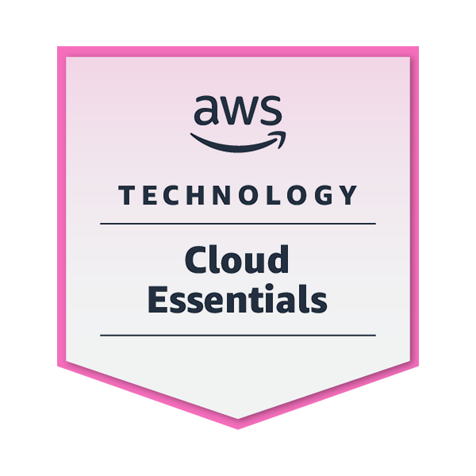](https://www.credly.com/badges/672dec06-3715-4304-93f7-39a9c59482c8/public_url) [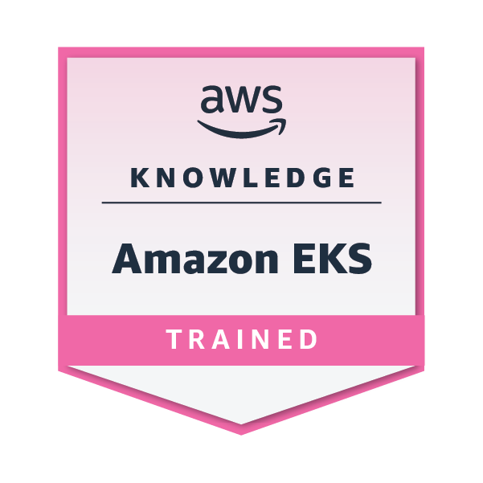](https://www.credly.com/badges/5cbac45a-2a2e-434c-bc43-bfad31b5dc97/public_url)

[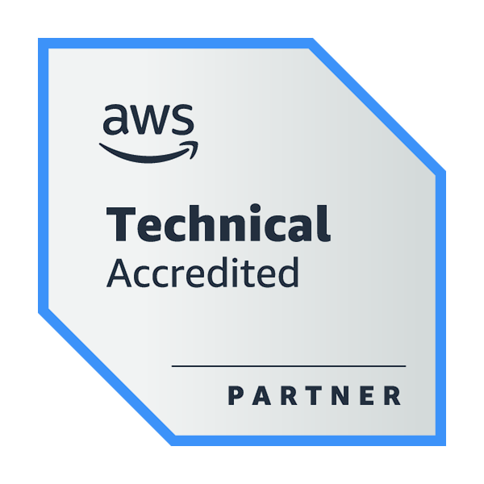](https://www.credly.com/badges/f37cada8-ee58-412d-a006-24aedc0e8c0f/public_url) [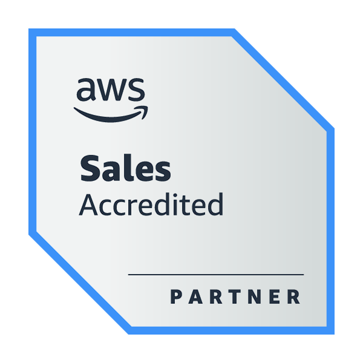](https://www.credly.com/badges/82a47f6c-f3f3-45aa-8463-b0b0596eef61/public_url) [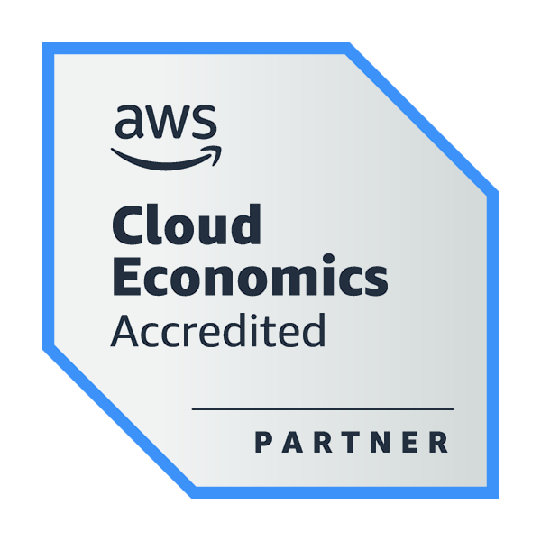](https://www.credly.com/badges/5cf4551a-0708-40cf-8994-d2b096c795b4/public_url) [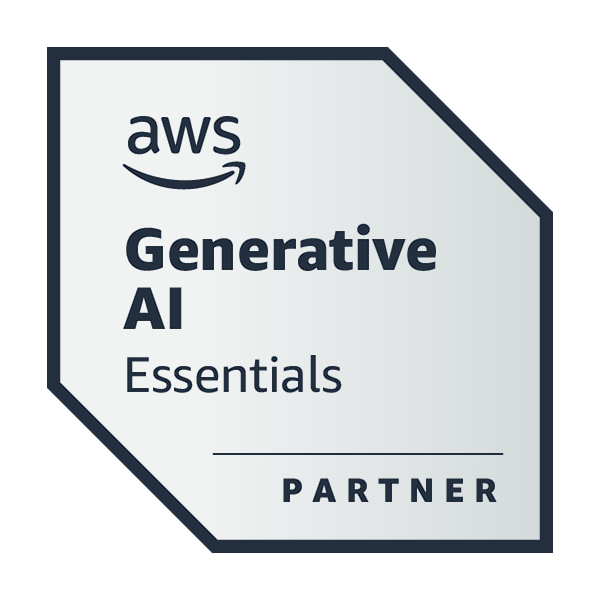](https://www.credly.com/badges/07164be7-e35b-4333-b6a7-50fb94febb85/public_url)

[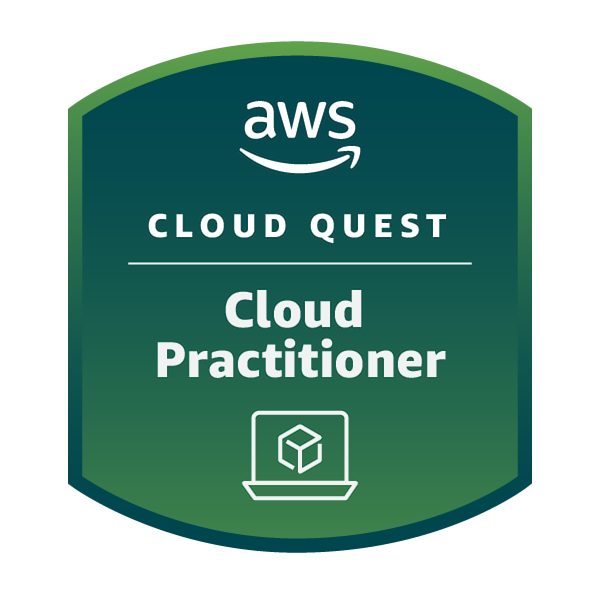](https://www.credly.com/badges/9f1b7d56-abe4-4905-8bc7-111b43958d37/public_url) [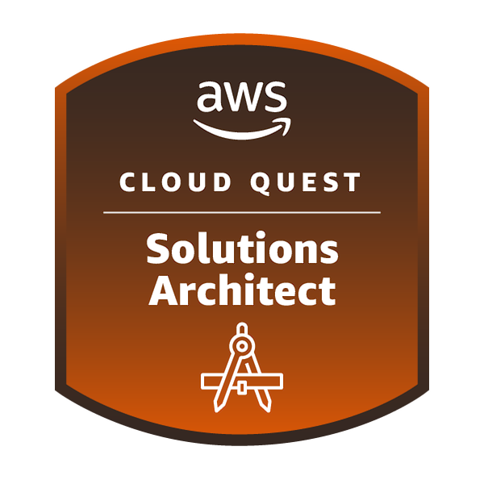](https://www.credly.com/badges/aacb2bfd-1fa7-49dc-bb9d-6b0fa0175f7d/public_url) [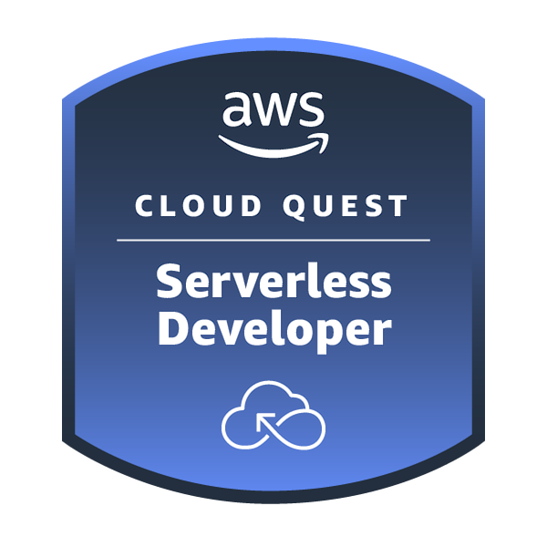](https://www.credly.com/badges/eca9bef9-1f7e-4b2f-841d-4777efa1107b/public_url) [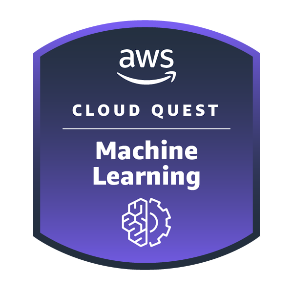](https://www.credly.com/badges/797ffa41-1171-4c5b-9edc-c34f71ba1080/public_url) [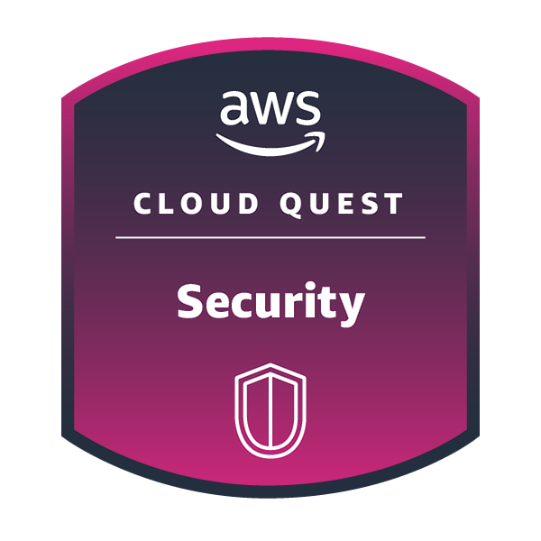](https://www.credly.com/badges/d8014913-33f5-4263-8632-2b37c34bb004/public_url) [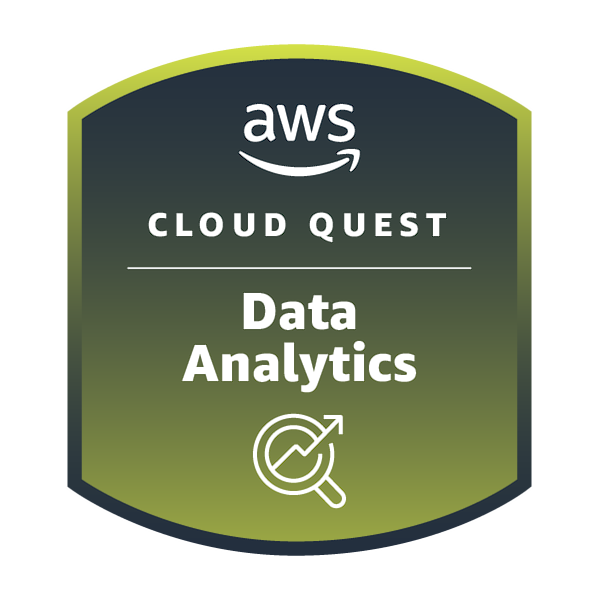](https://www.credly.com/badges/5191f2ad-a757-43d0-94b7-2baec2195770/public_url) [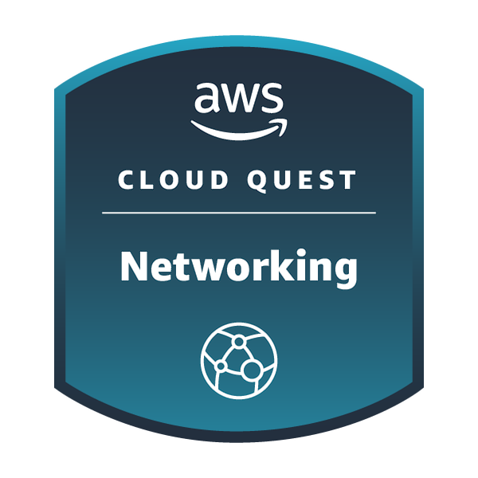](https://www.credly.com/badges/441ef82e-560a-4c19-8033-2b085fc9dfd0/public_url)

### ⚡ Scaled Agile (SAFe)

[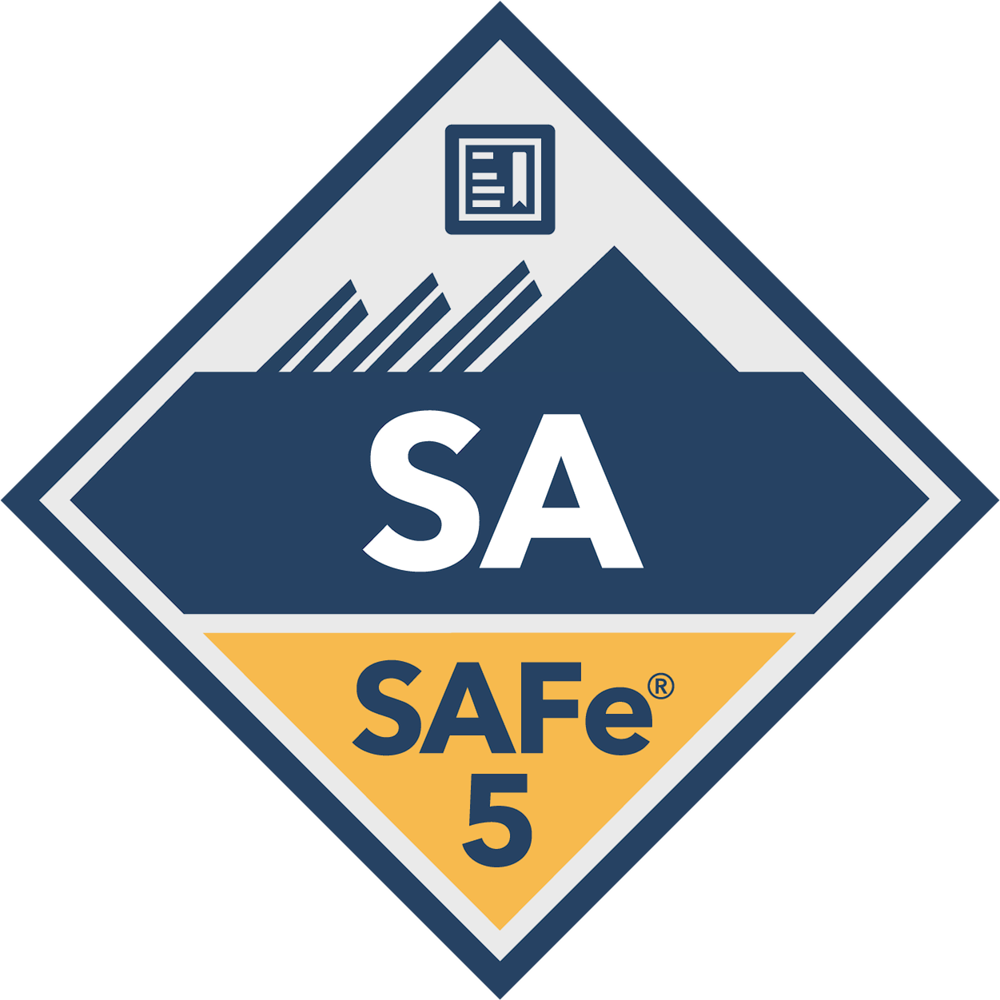](https://www.credly.com/badges/d82a7fed-b8e9-4d71-ad35-0d0950cb162f/public_url) [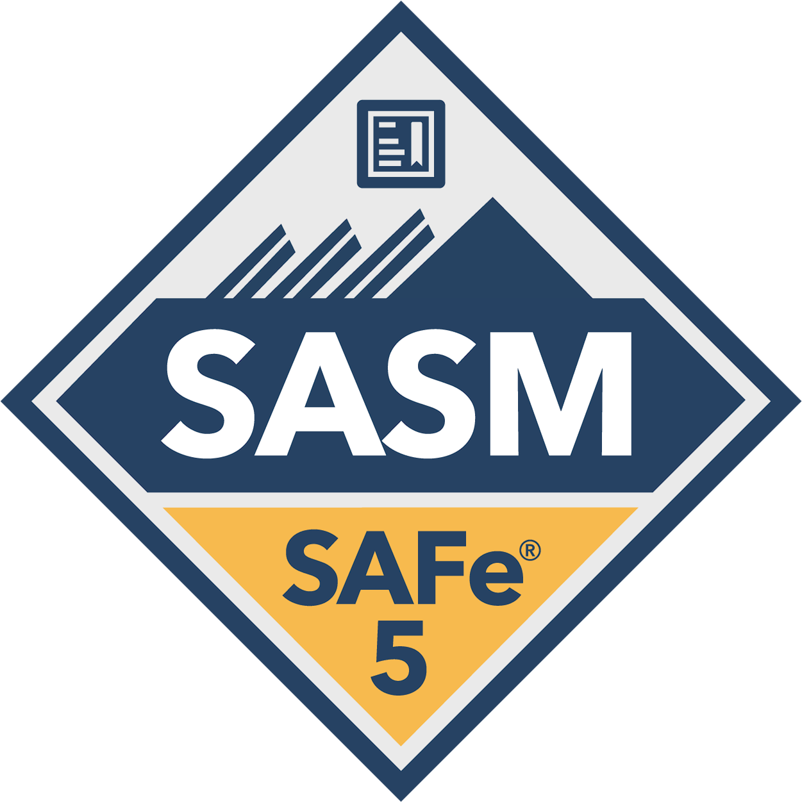](https://www.credly.com/badges/8688428a-aeb8-44d9-a1af-ce9a30c30cbd/public_url)
